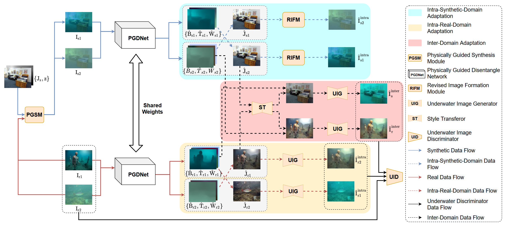

## SyreaNet: A Physically Guided Underwater Image Enhancement Framework Integrating Synthetic and Real Images

This repository contains the official implementation of the paper:

> **SyreaNet: A Physically Guided Underwater Image Enhancement Framework Integrating Synthetic and Real Images** (accepted by ICRA2023)<br>
> Junjie Wen, Jinqiang Cui*, Zhenjun Zhao, Ruixin Yan, Zhi Gao, Lihua Dou, Ben M. Chen <br>
> **Paper Link**: [[ICRA23](https://ieeexplore.ieee.org/document/10161531)][[arxiv](https://arxiv.org/pdf/2302.08269.pdf)]


## Overview

The overall architecture of our method. Specifically, synthetic underwater images are first generated by our proposed physically guided synthesis module (PGSM). Then, various synthetic and real underwater images are fed into the physically guided disentangled network, predicting the clear image, backscattering, transmission and white point. The intra- and inter- Domain Adaptations are done by exchanging the knowledge across attribute domains.


Enhancement examples under various underwater conditions. Video can be found at [Youtube](https://www.youtube.com/watch?v=DyOktx7_9JQ).


## Dataset
The synthesis and real-world dataset could be downloaded via:
[[BaiduYun]](https://pan.baidu.com/s/1iVAR_hSVmLMyrWcjm4HbbA) (Code:90gv)

## Synthesize Underwater Images
```shell
cd synthesize
python synthesize.py --image-dir <Path-To-InAir-Images> --depth-dir <Path-To-Depth-Maps> --out-dir <Output-Directory>
```
Note: To synthesize underwater images, in-air images and their corresponding depth maps are required.

## Test with Real Underwater Images
First, please download the pretrained checkpoint in [[GoogleDrive]](https://drive.google.com/file/d/1xGrq2jMpdM4mbgDfS4K_cfaeRiEqcgjZ/view?usp=sharing) [[BaiduYun]](https://pan.baidu.com/s/1x9x41K55j54D_2NmuEM4mQ) (Code:s8wq). After that, put the pretrained checkpoint in `checkpoints`.

For demo, just install the required packages with ``pip install -r requirements``. And then run
```shell
python test.py --config ./configs/syreanet_test.yaml --load-path ./checkpoints/pretrained.pth
```
The enhanced results of images in `samples` will be found in `output`.

For testing your own images, change the data_path `configs/syreanet_test.yaml` to the directory of your images. And run
```shell
python test.py --config ./configs/syreanet_test.yaml --load-path ./checkpoints/pretrained.pth --output-dir <YOUR_OUT_DIR>
```
The enhanced results will be found in `<YOUR_OUT_DIR>`.


## Citation
If you find our repo useful for your research, please consider citing our paper:
```bibtex
@INPROCEEDINGS{wen2023syreanet,
  author={Wen, Junjie and Cui, Jinqiang and Zhao, Zhenjun and Yan, Ruixin and Gao, Zhi and Dou, Lihua and Chen, Ben M.},
  booktitle={2023 IEEE International Conference on Robotics and Automation (ICRA)}, 
  title={SyreaNet: A Physically Guided Underwater Image Enhancement Framework Integrating Synthetic and Real Images}, 
  year={2023},
  volume={},
  number={},
  pages={5177-5183},
  keywords={Adaptation models;Codes;Automation;Image color analysis;Image synthesis;Atmospheric modeling;Data models},
  doi={10.1109/ICRA48891.2023.10161531}}
```

```bibtex
@article{wen2023syreanet,
  title={SyreaNet: A Physically Guided Underwater Image Enhancement Framework Integrating Synthetic and Real Images},
  author={Wen, Junjie and Cui, Jinqiang and Zhao, Zhenjun and Yan, Ruixin and Gao, Zhi and Dou, Lihua and Chen, Ben M},
  journal={arXiv preprint arXiv:2302.08269},
  year={2023}
}
```

### ToDo-List
* [x] Release the synthesizing code.
* [x] Release the testing code and model checkpoint.
* [ ] Release the training code.

### Acknowlegements
1. The coefficients for synthesizing underwater images are computed based on [hainh/sea-thru](https://github.com/hainh/sea-thru.git).
2. The WavePool/WaveUnpool are borrowed from [WCT2](https://github.com/clovaai/WCT2).
